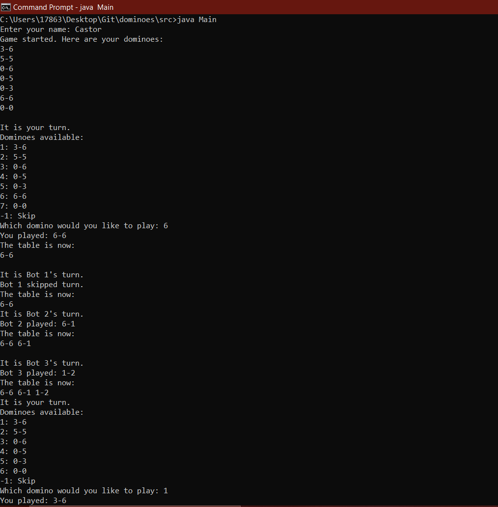
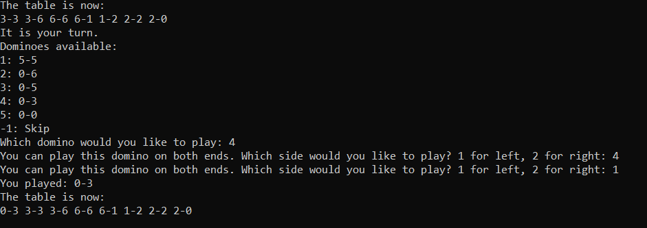

<h1 align="center"> Dominoes Game </h1>

## Description
This is a console-based dominoes game designed from scratch using Java. It applies basic OOP concepts such as encapsulationa and abstraction 

## Basic Functionality

## Advanced Features

### Smart side picking
If a domino that you want to play can only be played in one side, the program will automatically place the domino on that side, and reverse the domino if needed. If you can play the domino on both sides, the program will ask you which side you want to play it on

### Advanced Bots
Bots do not play dominoes randomly, nor they play the first domino they can play. Bots will assign a score to every domino in their hand based on the current state of the table and the other dominoes they have. Then, they will play the domino with the highest score. Doubles are assigned the maximum scored, therefore bots play doubles first.

### Blocked game recognition
The program can detect if the game is blocked and no more moves can be made, it will then count the dominoes for each player, the player with the lower number of dominoes points wins.

### False Skip not allowed
The game only lets you skip if you truly cannot play any domino, otherwise you have to play.

### 6-6 Always start the game
The player with 6-6 always starts the game, and he is forced to select the 6-6 as the starting domino.
